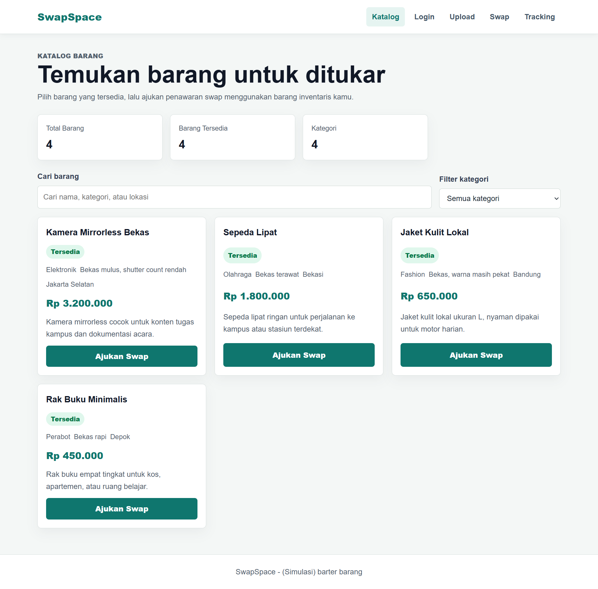
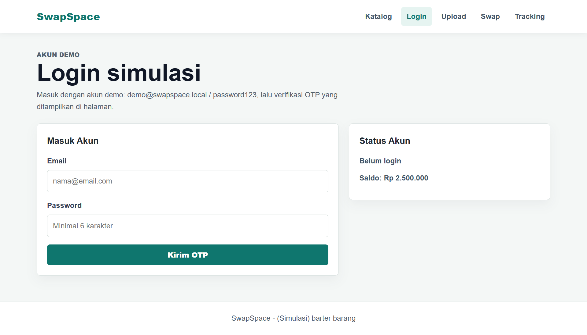
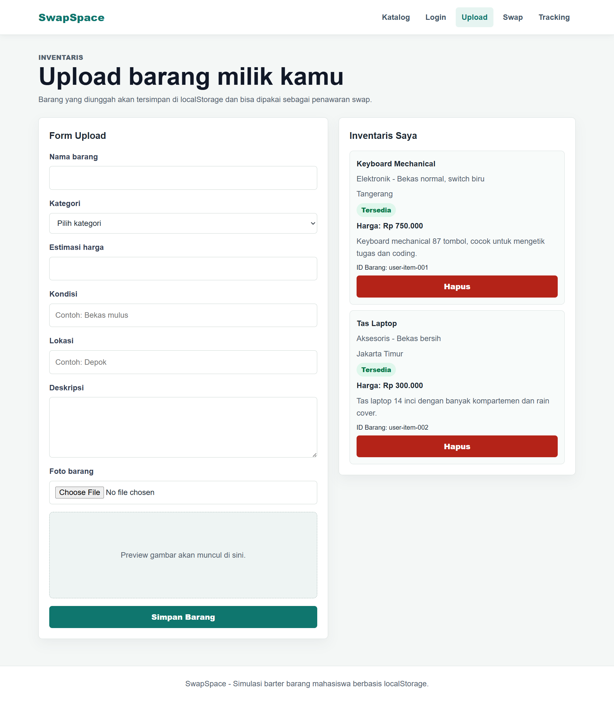
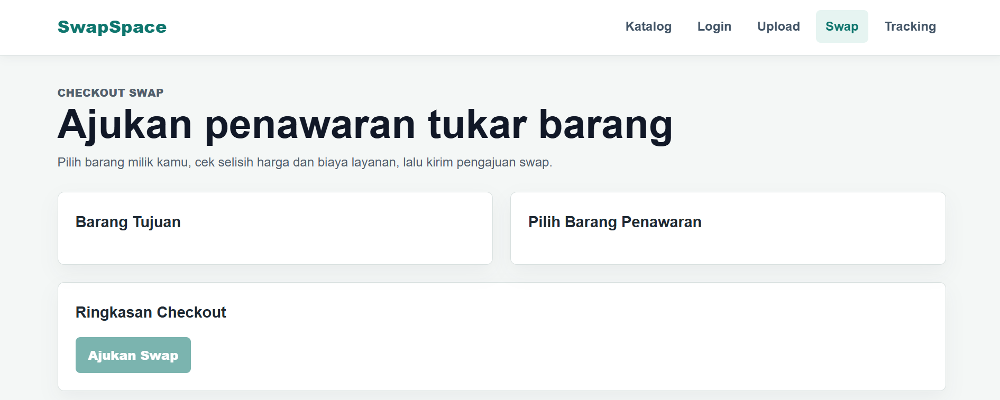
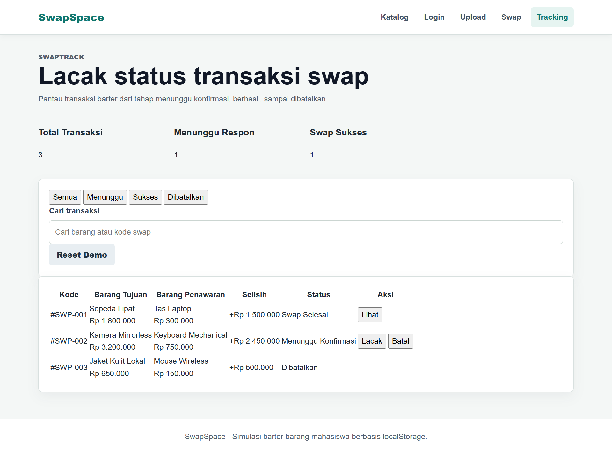

# SwapSpace

| Item | Value |
|------|-------|
| Project | SwapSpace |
| Version | v1.0.0 |
| Type | Static Web Application |
| Platform | Browser |
| Storage | localStorage |
| Deployment | GitHub Pages |
| Repository | GitHub |

SwapSpace adalah aplikasi web statis yang mensimulasikan proses pertukaran (barter) barang secara online. Aplikasi ini dikembangkan sebagai proyek akhir mata kuliah **Komputasi Awan dan Aplikasi Bergerak** untuk menunjukkan implementasi pengembangan aplikasi web modern menggunakan HTML, CSS, dan JavaScript tanpa framework.

Melalui SwapSpace, pengguna dapat melihat katalog barang, melakukan login simulasi, mengunggah barang yang dimiliki, mengajukan pertukaran dengan barang lain, serta memantau status transaksi. Seluruh data simulasi disimpan secara lokal menggunakan **localStorage**, sehingga aplikasi dapat dijalankan tanpa backend maupun database eksternal.

---

## Problem Background

Banyak barang yang masih layak digunakan tidak lagi dimanfaatkan oleh pemiliknya. Dalam kehidupan sehari-hari, proses pertukaran barang masih dilakukan secara langsung dan belum memiliki media sederhana yang dapat digunakan sebagai simulasi proses barter berbasis web.

Di sisi lain, pembelajaran pengembangan aplikasi web membutuhkan studi kasus yang mampu menggabungkan beberapa konsep, seperti pengelolaan data, antarmuka pengguna, navigasi antar halaman, penyimpanan data lokal, serta kolaborasi pengembangan menggunakan Git dan GitHub.

Berdasarkan kondisi tersebut, dikembangkan SwapSpace sebagai simulasi marketplace barter berbasis web yang sederhana, mudah dipahami, dan dapat digunakan sebagai media implementasi berbagai konsep pengembangan aplikasi modern.

---

## Problem Statement

Permasalahan yang menjadi dasar pengembangan SwapSpace adalah sebagai berikut.

1. Bagaimana membangun simulasi marketplace barter berbasis web tanpa menggunakan backend?
2. Bagaimana mengelola data pengguna, katalog barang, inventaris, dan transaksi menggunakan penyimpanan lokal pada browser?
3. Bagaimana mengimplementasikan proses pengembangan perangkat lunak secara kolaboratif menggunakan GitHub?
4. Bagaimana menghasilkan aplikasi web yang sederhana namun tetap memberikan pengalaman pengguna yang baik untuk kebutuhan demonstrasi akademik?

---

## Objectives

SwapSpace dikembangkan dengan tujuan untuk:

- Mengembangkan aplikasi web statis sebagai simulasi marketplace barter.
- Mengimplementasikan konsep pengembangan aplikasi menggunakan HTML, CSS, dan JavaScript.
- Menerapkan penyimpanan data lokal menggunakan localStorage.
- Menerapkan kolaborasi tim menggunakan Git dan GitHub selama proses pengembangan.
- Memberikan media demonstrasi proses barter digital dalam lingkungan akademik.

---

# Main Features

## Product Catalog

Pengguna dapat melihat daftar barang yang tersedia untuk ditukar. Setiap barang menampilkan informasi seperti nama, kategori, kondisi, pemilik, serta estimasi nilai barang. Fitur pencarian dan filter kategori membantu pengguna menemukan barang yang diinginkan dengan lebih cepat.

---

## Simulated Login

SwapSpace menyediakan sistem login simulasi menggunakan email, password, dan OTP lokal. Proses autentikasi ini dirancang sebagai demonstrasi alur login tanpa memerlukan backend maupun layanan autentikasi eksternal.

---

## Item Upload

Pengguna dapat menambahkan barang miliknya sendiri ke dalam inventaris aplikasi. Data barang disimpan menggunakan localStorage sehingga tetap tersedia selama data browser tidak dihapus atau di-reset.

---

## Swap Transaction

Pengguna dapat memilih barang yang ingin ditukar kemudian mengajukan proses pertukaran. Sistem akan menghitung simulasi nilai tukar, biaya layanan, serta ongkos pengiriman sehingga pengguna memperoleh gambaran sederhana mengenai proses barter digital.

---

## Transaction Tracking

Setelah proses pertukaran dilakukan, pengguna dapat melihat riwayat transaksi beserta statusnya melalui halaman Tracking. Halaman ini juga menyediakan tombol **Reset Demo** untuk mengembalikan seluruh data ke kondisi awal sehingga aplikasi dapat digunakan kembali saat presentasi.

---

# Technology Stack

| Technology | Purpose |
|------------|---------|
| HTML5 | Struktur halaman aplikasi |
| CSS3 | Mendesain antarmuka dan tata letak responsif |
| JavaScript (Vanilla) | Mengelola logika aplikasi dan interaksi pengguna |
| localStorage | Menyimpan data simulasi di browser |
| Git | Version Control |
| GitHub | Repository dan kolaborasi tim |
| GitHub Pages | Deployment aplikasi |

### Why Vanilla JavaScript?

SwapSpace dikembangkan menggunakan HTML, CSS, dan JavaScript murni tanpa framework agar proses pembelajaran lebih berfokus pada pemahaman dasar pengembangan web, manipulasi DOM, manajemen data lokal, serta implementasi logika aplikasi secara langsung.

Pendekatan ini juga membuat aplikasi lebih ringan, mudah dipahami, dan mudah dijalankan tanpa proses build ataupun dependency tambahan.

---

# System Requirements

## Browser

- Google Chrome
- Microsoft Edge
- Mozilla Firefox

## Operating System

- Windows
- Linux
- macOS

## Internet Connection

Internet hanya diperlukan saat membuka aplikasi melalui GitHub Pages. Seluruh data simulasi diproses secara lokal di browser.

---

# Installation

1. Clone repository.

```bash
git clone https://github.com/aldoprawiroa/Marketplace-Barter.git
```

2. Masuk ke folder project.

```bash
cd SwapSpace
```

3. Jalankan menggunakan Live Server atau buka `index.html`.

4. Aplikasi siap digunakan.

---
# Live Demo

**GitHub Repository**

https://github.com/aldoprawiroa/Marketplace-Barter

**Live Website**

https://aldoprawiroa.github.io/Marketplace-Barter/
---
# Usage Guide

1. Login menggunakan akun demo.
2. Jelajahi katalog barang.
3. Cari barang menggunakan fitur pencarian.
4. Filter berdasarkan kategori.
5. Upload barang milik sendiri.
6. Pilih barang yang ingin ditukar.
7. Lakukan simulasi swap.
8. Lihat status transaksi pada halaman Tracking.
9. Gunakan **Reset Demo** sebelum presentasi berikutnya.

---

# System Architecture

SwapSpace menggunakan arsitektur aplikasi web statis (Static Web Application). Seluruh logika aplikasi dijalankan di sisi klien (client-side) menggunakan JavaScript, sedangkan penyimpanan data dilakukan menggunakan localStorage.

```text
                GitHub Pages
                      │
                      ▼
              Static Website Files
          (HTML + CSS + JavaScript)
                      │
                      ▼
                 Web Browser
                      │
      ┌───────────────┼────────────────┐
      ▼               ▼                ▼
 Catalog Module   Upload Module   Swap Module
      │               │                │
      └───────────────┴────────────────┘
                      │
                      ▼
                 localStorage
```

---

# Module Architecture

| Module | Responsibility |
|---------|----------------|
| catalog.js | Menampilkan katalog, pencarian, dan filter |
| account.js | Login simulasi dan profil pengguna |
| upload.js | Menambahkan barang |
| swap.js | Simulasi pertukaran barang |
| track.js | Tracking transaksi |
| utils.js | Utility functions |
| data.js | Seed data aplikasi |

---

# Data Flow

```text
User
   │
   ▼
Input
   │
   ▼
JavaScript Module
   │
   ▼
Validation
   │
   ▼
localStorage
   │
   ▼
Update Interface
```

---

# Development Process

Pengembangan SwapSpace dilakukan melalui tahapan berikut.

1. Requirement Analysis
2. System Design
3. Repository Initialization
4. Development
5. Testing
6. Deployment
7. Release v1.0.0

```text
Requirement Analysis
        │
        ▼
System Design
        │
        ▼
Repository Setup
        │
        ▼
Development
        │
        ▼
Testing
        │
        ▼
Deployment
        │
        ▼
Release v1.0.0
```

---

# Git Collaboration

SwapSpace dikembangkan secara kolaboratif menggunakan Git dan GitHub.

GitHub digunakan sebagai:

- Version Control
- Repository Management
- Collaboration
- Backup Source Code
- Release Management
- GitHub Pages Deployment

---

# Screenshots

## Home

Halaman utama aplikasi yang menampilkan katalog barang.



---

## Login

Halaman login menggunakan autentikasi simulasi.



---

## Upload

Halaman untuk menambahkan barang milik pengguna.



---

## Swap

Halaman simulasi proses pertukaran barang.



---

## Tracking

Halaman untuk melihat status transaksi.



---

# Functional Testing

| No | Feature | Expected Result | Status |
|----|----------|----------------|--------|
| 1 | Login | Login berhasil | ✅ Pass |
| 2 | Product Catalog | Data tampil | ✅ Pass |
| 3 | Search | Barang ditemukan | ✅ Pass |
| 4 | Filter | Barang terfilter | ✅ Pass |
| 5 | Upload Item | Barang tersimpan | ✅ Pass |
| 6 | Swap | Swap berhasil | ✅ Pass |
| 7 | Tracking | Riwayat tampil | ✅ Pass |
| 8 | Reset Demo | Data kembali ke awal | ✅ Pass |

---

# Current Limitations

SwapSpace masih merupakan aplikasi simulasi sehingga memiliki beberapa keterbatasan.

- Belum menggunakan backend.
- Belum menggunakan database eksternal.
- Data hanya tersimpan di localStorage.
- Login masih berupa simulasi.
- Belum mendukung upload gambar ke cloud storage.
- Belum mendukung komunikasi real-time.

---

# Future Improvements

Pengembangan berikutnya yang dapat dilakukan antara lain:

- Backend menggunakan Node.js atau Backend-as-a-Service.
- Integrasi database seperti Supabase atau Firebase.
- Sistem autentikasi pengguna.
- Upload gambar ke cloud storage.
- Notifikasi real-time.
- Sistem chat antar pengguna.
- Dashboard administrator.
- Progressive Web App (PWA).
- Optimasi tampilan mobile.

---

# Contributors

| Name | Responsibility |
|------|----------------|
| Aldo | Catalog Module, Search Feature, Repository Management |
| Abdil | Login & Authentication Simulation |
| Ibrahim | Upload Module |
| Faiz | Swap Transaction Module |
| Indra | Tracking Module |

---

# Repository Information

Repository ini menggunakan Git sebagai sistem version control.

Seluruh perubahan source code didokumentasikan melalui commit history sehingga perkembangan proyek dapat ditelusuri dengan mudah.

Aplikasi dipublikasikan menggunakan GitHub Pages sehingga dapat diakses langsung melalui browser.

---

# License

This project was developed for academic purposes as part of the Final Project for the **Cloud Computing and Mobile Application** course.

Copyright © 2026 SwapSpace Team.
